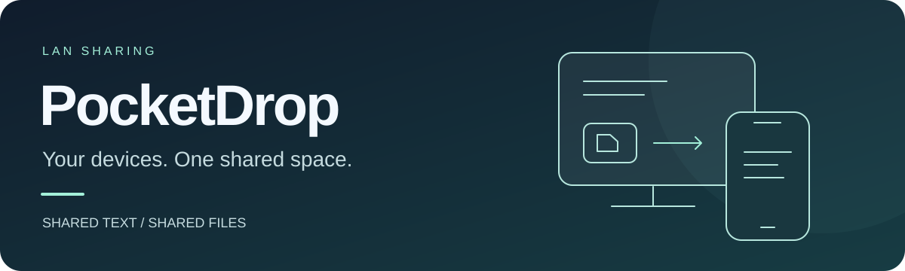
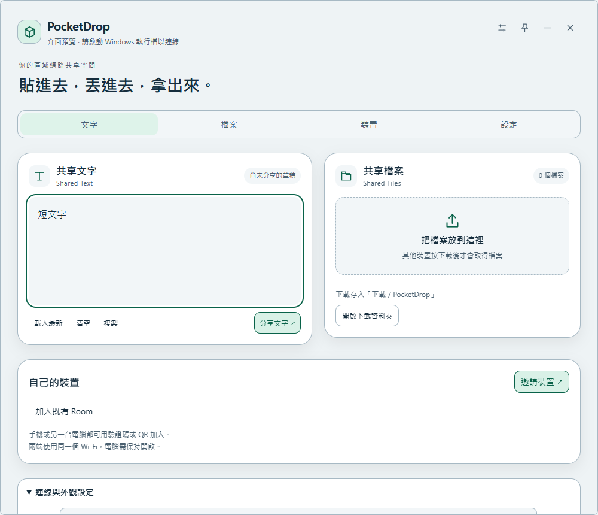

<p align="center">
  
</p>

<h1 align="center">PocketDrop</h1>

<p align="center">
  <strong>貼進去。丟進去。拿出來。</strong><br>
  區域網路裡的共享暫存盒，讓電腦與手機共用一個 Room。<br>
  不需要帳號、不需要雲端儲存，也不用輸入 IP。
</p>

<p align="center">
  <a href="https://github.com/OverGreen996/PocketDrop/releases/tag/v1.0.6"></a>
  <a href="https://github.com/OverGreen996/PocketDrop/releases/tag/android-v1.0.2"></a>
</p>

<p align="center">
  <a href="#下載與安裝"><strong>下載安裝</strong></a> ·
  <a href="#開始使用">開始使用</a> ·
  <a href="#外觀與操作">外觀與操作</a> ·
  <a href="#開發">開發文件</a>
</p>

---

## 手機和電腦，接起來就好

在電腦貼上一段文字，手機就能取用；把檔案拖進 Widget，另一台裝置就能看到。需要檔案時再下載，不必先替每台裝置複製一份。

| Shared Text | Shared Files |
| :--- | :--- |
| 分享網址、程式碼、筆記或 Prompt | 分享圖片、PDF、ZIP、STL 等一般檔案 |
| 貼上 → 按「分享文字」→ 其他裝置查看、複製 | 拖入 → 同步檔案資訊 → 需要時下載 |
| 手機也能從系統分享選單送入文字 | 手機也能選檔或從系統分享選單加入檔案 |

> [!IMPORTANT]
> **目前版本需要建立 Room 的電腦保持開啟。** 其他電腦和 Android 手機需使用相同 Wi-Fi／LAN；Android 需開啟 App 才會連線。

## 下載與安裝

| 平台 | 安裝包 | 系統需求 |
| :--- | :--- | :--- |
| **Windows** | [**下載 Windows 1.0.6**](https://github.com/OverGreen996/PocketDrop/releases/download/v1.0.6/PocketDrop-1.0.6-Windows-x64-Setup.exe) | Windows 10／11，x64；需要 WebView2 |
| **Android** | [**下載 Android 1.0.2 APK**](https://github.com/OverGreen996/PocketDrop/releases/download/android-v1.0.2/PocketDrop-1.0.2-Android.apk) | Android 8.0 以上 |

[所有版本與 SHA256 校驗檔](https://github.com/OverGreen996/PocketDrop/releases) · [回報問題](https://github.com/OverGreen996/PocketDrop/issues)

Windows 執行安裝包即可；Android 將 APK 複製到手機後點擊安裝。已有舊版時，**直接覆蓋更新，不要先解除安裝**，以保留配對與資料。

<details>
<summary>安裝前須知與相容性</summary>

Windows 清晰外觀以 Windows 10／11 為目標，不依賴原生玻璃；尚未完成 Windows 10 實機驗證，不承諾 Windows 7／8 相容。原生玻璃需要 Windows 11 22H2 以上。iOS 尚未提供。

Windows 安裝於目前使用者帳號，安裝包尚未使用 Authenticode 簽章。尚未安裝 WebView2 時，安裝程序需要連網下載 Microsoft 官方執行環境。Android 首次安裝可能需要允許安裝來源。

</details>

## 開始使用

1. 在一台常開的電腦啟動 PocketDrop。首次啟動會準備自己的 Room。
2. 按 **邀請裝置**，畫面會顯示電腦編號、8 位驗證碼及 QR Code。
3. 第二台電腦按 **加入既有 Room**；Android 到 **裝置 → 輸入驗證碼加入**，選擇相同編號並輸入驗證碼。也可掃描 QR；沒有攝影機的電腦可選取 QR 圖片。
4. 所有裝置使用同一個 Wi-Fi／LAN。配對完成後會保存身分，重新開啟、換 IP 或連接埠改變時自動尋找原有電腦，不用重掃。
5. 貼上文字後按 **分享文字**。將檔案直接拖進 Windows Widget；其他裝置按 **下載** 才取得檔案。

Windows 防火牆提示是讓自己的裝置能在私人網路連線；請允許信任的私人網路。訪客 Wi-Fi 的裝置隔離可能阻止互相發現。

## 外觀與操作



*Windows 前端介面預覽，使用示例文字；非原生玻璃實機效果截圖。*

按右上角 **◐ → 外觀**，選擇適合你的桌面風格；設定會保存。

| 外觀 | 適用情境 |
| :--- | :--- |
| **清晰深色** · 預設 | 深色不透明底，桌布不影響文字閱讀 |
| **清晰淺色** | 偏好明亮介面，或需要更清楚的文字對比 |
| **原生玻璃** | Windows 11 22H2 以上，使用 Windows 原生背景材質 |

**拖曳視窗四邊或四角，就能自由調整大小。** 文字區也會隨內容增高；超過上限後捲動，方便框選與複製。

<details>
<summary>文字區尺寸與 Windows 外觀差異</summary>

視窗可拖曳四邊及四角調整大小（最小 400 × 480）。文字區依內容與換行自動增高，最多採計前 1,000 個字元，並以視窗高度 65%／600 px 為上限（最小 180 px）。超過時在文字區捲動；內容不截斷，仍可框選、Ctrl+A 及複製。

前 1,000 字元是高度計算範圍，不是文字內容的長度限制。清晰外觀不依賴 Windows 11 玻璃及圓角 API；Windows 10 可能顯示直角外框。玻璃不支援時會提示並改用清晰深色。

上方橫幅是品牌示意圖，不是軟體實機截圖。

</details>

## 檔案流向與目前限制

**建立 Room 的電腦必須保持開啟。** 這是目前版本採用的運作方式，尚未提供無中央裝置的 Room。

- Windows 電腦拖入的檔案只登錄資訊，不預先複製。下載時由 Room 電腦轉送來源電腦的串流，不落地保存中繼副本。
- Android 分享／加入檔案會上傳至 Room 電腦保存；接收裝置仍按需下載。
- 電腦下載位置為 `下載/PocketDrop`。Android 10 以上存入 `Downloads/PocketDrop`；Android 8–9 存入 App 專用下載資料夾。
- 來源電腦離線後約 12 秒內顯示不可用；重新上線會恢復。已移除紀錄不會被來源重新宣告而復活。
- 每台來源電腦最多 200 筆檔案；單檔最多 16 GiB，每次拖入最多 100 個。不支援資料夾，請先壓縮成 ZIP。
- 支援進度、取消、串流、SHA-256、HTTP Range；尚未提供下載中斷後的自動續傳介面。
- Android 開啟 App 後連線；不提供背景常駐同步服務。
- 未配對裝置不能讀取文字或檔案；驗證碼／QR 邀請 5 分鐘到期、一次使用。驗證碼採 SRP-6a，TLS 憑證與請求裝置身分一併驗證；不在 mDNS 廣播配對碼或 Room 秘密。

## 線上更新

Windows 1.0.5 起，每次啟動會在背景檢查 GitHub 新版。出現提示後按「是，更新」，程式下載並驗證簽章，接著關閉並啟動覆蓋更新，完成後重新開啟。也可在「連線與外觀設定」按「檢查更新」。按「稍後」不會下載或安裝。

舊版請先手動安裝 1.0.5 或更新版本一次，以後不用手動下載安裝包或解除安裝。這是完整程式包的原地更新，不是不中斷執行的熱更新或差分更新。更新期間 Room 暫時離線；配對、設定、資料與未分享文字草稿保留。請先完成所有裝置的檔案傳輸。

只有版本檢查與更新包下載會連到 GitHub；共享文字、檔案與配對仍在 LAN。沒有網際網路時可以照常分享，更新失敗可稍後手動重試。Android 1.0.2 起也支援啟動檢查與「裝置 → 檢查 App 更新」。先手動覆蓋安裝本版一次，之後可在 App 內下載 APK，經 Android 系統確認後更新。首次可能需要允許 PocketDrop 安裝 App；不會繞過系統確認。

發布流程與簽章金鑰管理見 [docs/UPDATES.md](docs/UPDATES.md)。

## 從原有版本更新

Windows 保留原本的應用程式識別及本機資料路徑；Android 保留套件識別與發佈簽章，更新可沿用既有配對。請先關閉舊版 Windows PocketDrop，再啟動安裝後的版本，避免同一個 Room 同時啟動兩份。

## 常見問題

<details>
<summary>已配對，卻顯示離線或找不到電腦？</summary>

先確認 Room 電腦已開啟 PocketDrop、手機已開啟 App，兩端使用相同 LAN。防火牆需允許信任的私人網路；訪客 Wi-Fi 或裝置隔離可能阻止連線。通常不需要重新配對。

仍無法連線時，請到 [Issues](https://github.com/OverGreen996/PocketDrop/issues) 提供系統版本、App 版本與重現步驟，不要附配對 QR 或憑證。

</details>

<details>
<summary>能從外面連回家裡，或讓 Room 電腦關機嗎？</summary>

目前只支援 LAN，建立 Room 的電腦必須保持開啟。不提供網際網路遠端連線、資料夾同步、自動備份或雲端儲存；Android 尚未提供背景常駐同步，iOS 尚未推出。

</details>

## 開發

需要 Node.js、Rust MSVC、Visual Studio C++ Build Tools、WebView2；Android 需要 JDK 17、Gradle 8.11.1 與 Android SDK 35。

```powershell
npm ci
npm run desktop
npm run build
npm run test:rust
```

`npm run package` 需要更新簽章金鑰，請先閱讀 [更新發布流程](docs/UPDATES.md)；儲存庫不包含官方私鑰。Windows 安裝包輸出於 `src-tauri/target/release/bundle/nsis/`。

Android：設定 `ANDROID_HOME`、`JAVA_HOME`，以 Gradle 執行 `assembleRelease lintRelease testReleaseUnitTest`。正式更新簽章由本機環境提供，不包含在 Git 中；其他開發者應透過 `POCKETDROP_KEYSTORE`、`POCKETDROP_STORE_PASSWORD`、`POCKETDROP_KEY_ALIAS`、`POCKETDROP_KEY_PASSWORD` 指定自己的簽章。自行簽署的 APK 無法直接覆蓋官方 APK。

原始 Windows／Android 實驗記錄保留在 `docs/`，它們描述歷史版本。目前架構請看 [ARCHITECTURE_v1.0.md](docs/ARCHITECTURE_v1.0.md)，版本更新請看 [Windows 1.0.6](docs/RELEASE_1.0.6.md) 與 [Android 1.0.2](docs/RELEASE_ANDROID_1.0.2.md)。

## 1.0.6 變更

Windows 介面重新設計，新增文字／檔案／裝置／設定快速導覽，放大操作區並改善寬視窗排版。已移除外部程式介接模組，啟動時撤銷舊 Daily-Agent 模組建立的配對。PocketDrop 裝置間的區域網路配對與同步保留。

Android 介面調整已納入原始碼，但 1.0.3 尚未發布：原 Android 發布簽章金鑰不在目前工作區，現有下載仍為 1.0.2，未變更 Android OTA 清單。
